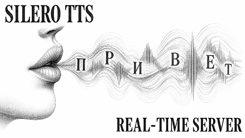

# Silero TTS Real-Time Server



Сервер синтеза речи на базе модели `Silero 5.5 ru`.

WIP. [CPU сервер для win7+ x64 Всё-в-Одном](https://drive.google.com/file/d/1yBYmxAb43OktS8t_-VyOr0bL8weJpiJY/view?usp=sharing) - обновляемая ссылка.  
Обсуждение - [Luna Translator на форуме 4PDA](https://4pda.to/forum/index.php?showtopic=1100472) / [Silero TTS Real-Time Server на форуме 4PDA](https://4pda.to/forum/index.php?showtopic=1121680).  
Исходный код - [GitHub](https://github.com/pav1388/Silero-TTS-Real-Time-Server/).

## Оглавление

- [Особенности](#особенности)
- [Системные требования и производительность](#системные-требования-и-производительность)
- [Установка](#установка)
- [Подготовка модели](#подготовка-модели)
- [Запуск сервера](#запуск-сервера)
- [Аргументы командной строки и переменные окружения](#аргументы-командной-строки-и-переменные-окружения)
- [API Роуты](#api-роуты)
- [Интеграция с Luna Translator](#интеграция-с-luna-translator)
- [Тесты и отладка](#тесты-и-отладка)
- [Благодарности](#благодарности)
- [Разное](#разное)

## Особенности

- **Потоковый режим генерации** — начинает озвучивать сразу, независимо от длины текста.
- **Качество голоса** — используется модель Silero v5_5_ru.
- **Расстановка ударений и ё-фикация** — обрабатываются моделью (почти корректное чтение русского текста).
- **Чтение числовых значений и транслитерация латиницы** — обрабатываются сервером.
- **Дополнительные голоса** — `RANDOM` (каждый запрос случайный голос), `RANDOM_M` (случайный мужской), `RANDOM_F` (случайный женский) и `HASH` (одинаковый текст озвучивается одним голосом).
- **Производительность** — снижение качества генерируемого голоса при высокой нагрузке на CPU.
- **Вычисления на GPU** — по умолчанию CPU, так как CPU быстрее на коротких репликах.
- **Тестирование** — есть отладочный вывод и простой HTML5 клиент `tts-rt-simple-client.html`.
- **Адаптация под свой проект** — использовать или переписать функцию `_setup_routes()` в классе `HTTPServer`.

## Системные требования и производительность

### Минимальные требования
- **Процессор:** с поддержкой инструкций AVX2
- **Видеокарта:** Nvidia или AMD (опционально, для GPU-вычислений)
- **Операционная система:** x64 (Windows 7+). Внимание: Python 3.8.10 — последняя версия для Windows 7, 32-битная версия не поддерживается из-за отсутствия 32-битного PyTorch
- **Остальные требования:** соответствуют PyTorch 2.x

### Производительность
- **Пример на ноутбуке с i3-7100U:** коэффициент генерации примерно 0.06-0.12 (на 8-16 секунд речи тратится 1 секунда вычислений)
- **Потребление ОЗУ:** Luna Translator (~125 Мб) + CPU сервер (~700 Мб) = итого ~850 Мб

## Установка

1. Установите [Python 3.8.10](https://www.python.org/downloads/release/python-3810/) для Windows 7+ или [Python 3.11.9](https://www.python.org/downloads/release/python-3119/) для Windows 8+.

2. Установите необходимые зависимости:
   ```bash
   pip install numpy bottle num2words
   ```

3. Установите PyTorch в зависимости от желаемого используемого оборудования:

   **Для CPU (размер пакета ~120-180 Мб):**
   ```bash
   pip install torch --index-url https://download.pytorch.org/whl/cpu
   ```

   **Для GPU Nvidia около GTX 10xx (размер пакета ~2.8 Гб, поддержка CPU включена в пакет):**
   ```bash
   pip install torch --index-url https://download.pytorch.org/whl/cu118
   ```
   
   **Для GPU Nvidia около GTX 30xx (размер пакета ~2.8 Гб, поддержка CPU включена в пакет):**
   ```bash
   pip install torch --index-url https://download.pytorch.org/whl/cu121
   ```
   
   **Для GPU AMD (поддержка CPU включена в пакет):**
   ```bash
   pip install torch --index-url https://download.pytorch.org/whl/rocm5.6
   ```

4. При первом запуске сервера разрешите доступ в брандмауэре ОС, если появится уведомление.

## Подготовка модели

1. Программа сама скачает модель в случае её отсутствия при запуске.

   или

2. Создайте папку `models` в директории рядом с файлом `silero-tts-rt-server.py`.  
Скачайте и поместите модель в папку `models`:
   - [Модель v5_5_ru.pt (~140 Мб)](https://models.silero.ai/models/tts/ru/v5_5_ru.pt)
   - другие доступны в [репозитории Silero](https://models.silero.ai/models/tts/ru/).

## Запуск сервера

Запустите файл `silero-tts-rt-server.py` или bat-файл с выбором устройства из папки `scripts`.

## Аргументы командной строки и переменные окружения

<details>
<summary> Нажмите, чтобы развернуть список аргументов</summary>

Сервер поддерживает следующие аргументы командной строки и переменные окружения для настройки поведения:

| Аргумент | Переменная окружения | Значение по умолчанию | Описание |
|----------|---------------------|----------------------|----------|
| `--debug` | `DEBUG` | `0` | Включает отладочный режим (подробное логирование, дополнительный вывод) |
| `--cuda` или `--gpu` | `CUDA` | `0` | Включает вычисления на GPU (NVIDIA CUDA). По умолчанию используется CPU, так как CPU быстрее на коротких репликах |
| `--no-cpu-monitor` | `NO_CPU_MONITOR` | `0` | Отключает мониторинг загрузки CPU (может повысить производительность, но снижает адаптивность при высокой нагрузке) |

**Приоритет:** аргументы командной строки имеют приоритет над переменными окружения.

**Примеры использования:**

```bash
# Включение отладки
python silero-tts-rt-server.py --debug

# Использование GPU
python silero-tts-rt-server.py --cuda

# Использование GPU с отключенным мониторингом CPU
python silero-tts-rt-server.py --cuda --no-cpu-monitor

# Через переменные окружения (Windows)
set DEBUG=1 && set CUDA=1 && python silero-tts-rt-server.py

# Через переменные окружения (Linux/Mac)
DEBUG=1 CUDA=1 python silero-tts-rt-server.py
```

**Примечания:**
- Для работы `--cuda/--gpu` требуется установленная версия PyTorch с поддержкой CUDA и совместимая видеокарта Nvidia
- Режим `--debug` полезен при отладке проблем с синтезом речи или интеграцией
- Отключение мониторинга CPU (`--no-cpu-monitor`) рекомендуется только на выделенных серверах без других нагрузок

</details>

## API Роуты

<details>
<summary> Нажмите, чтобы развернуть список эндпоинтов</summary>

### `GET /speakers`

Возвращает список доступных голосов (спикеров) в формате JSON.

**Пример запроса:**
```bash
http://127.0.0.1:23457/speakers
```

**Формат ответа:**
```json
{
  "silero": [
    {"id": 0, "name": "aidar", "gender": "male", "lang": "ru"},
    {"id": 1, "name": "baya", "gender": "female", "lang": "ru"},
    {"id": 2, "name": "kseniya", "gender": "female", "lang": "ru"},
    {"id": 3, "name": "eugene", "gender": "male", "lang": "ru"},
    {"id": 4, "name": "xenia", "gender": "female", "lang": "ru"},
    {"id": 5, "name": "RANDOM", "gender": "both", "lang": "ru"},
    {"id": 6, "name": "RANDOM_M", "gender": "male", "lang": "ru"},
    {"id": 7, "name": "RANDOM_F", "gender": "female", "lang": "ru"},
    {"id": 8, "name": "HASH", "gender": "both", "lang": "ru"}
  ]
}
```

**Доступные голоса:**
| ID | Имя | Пол | Язык |
|----|-----|-----|------|
| 0 | aidar | male | ru |
| 1 | baya | female | ru |
| 2 | kseniya | female | ru |
| 3 | eugene | male | ru |
| 4 | xenia | female | ru |

**Специальные голоса:**
| ID | Имя | Описание |
|----|-----|----------|
| 5 | RANDOM | Случайный голос при каждом запросе |
| 6 | RANDOM_M | Случайный мужской голос |
| 7 | RANDOM_F | Случайный женский голос |
| 8 | HASH | Одинаковый текст озвучивается одним и тем же голосом (на основе хеша текста) |

---

### `GET /speak` и `GET /speak/stream`

Синтезирует речь из текста. `/speak` возвращает полный WAV-файл, `/speak/stream` возвращает аудио потоком (чанками) в реальном времени.

**Параметры запроса:**

| Параметр | Тип | По умолчанию | Описание |
|----------|-----|--------------|----------|
| `text` | string | - | Текст для озвучивания (обязательный) |
| `id` | int | 0 | ID голоса (спикера) |
| `speed` | int | 100 | Скорость речи (% от нормальной) |
| `pitch` | string | "medium" | Высота тона ("x-low", "low", "medium", "high", "x-high") |
| `vol_boost` | float | 0 | Усиление громкости (dB) |

**Примеры запросов:**

```bash
# Базовый запрос с текстом
http://127.0.0.1:23457/speak?text=Привет!

# С выбором голоса и скорости
http://127.0.0.1:23457/speak?text=Как дела?&id=1&speed=80

# С изменением высоты тона
http://127.0.0.1:23457/speak?text=Как погода?&pitch=high

# Полный набор параметров
http://127.0.0.1:23457/speak/stream?text=АЗАЗА. Мне нравятся ноги твои и глаза.&id=3&speed=110&pitch=x-low&vol_boost=2
```

**Ответы:**
- `/speak` → `audio/wav` — бинарные данные WAV-файла
- `/speak/stream` → `application/octet-stream` — поток аудиоданных

---

### `GET /speak/raw`

Прямой SSML доступ к модели.

**Параметры запроса:**

| Параметр | Тип | По умолчанию | Описание |
|----------|-----|--------------|----------|
| `text` | string | "" | SSML-текст для озвучивания (обязательный) |
| `speaker` | string | "aidar" | Имя голоса (aidar, baya, kseniya, eugene, xenia) |
| `sample_rate` | int | 48000 | Частота дискретизации аудио (Гц) |
| `put_accent` | bool | true | Расставлять ударения в словах |
| `put_yo` | bool | true | Заменять "е" на "ё" где необходимо |
| `put_stress_homo` | bool | true | Расставлять ударения в омографах |
| `put_yo_homo` | bool | true | Заменять на "ё" в омографах |

**Примеры запросов:**

```bash
# Базовый запрос
http://127.0.0.1:23457/speak/raw?text=<speak>Привет, мир!</speak>

# С указанием голоса и частоты дискретизации
http://127.0.0.1:23457/speak/raw?text=<speak>Здравствуйте!</speak>&speaker=baya&sample_rate=24000

# Отключение авто-расстановки ударений
http://127.0.0.1:23457/speak/raw?text=<speak>Замок стоит на холме.</speak>&put_accent=false

# С установкой скорости
http://127.0.0.1:23457/speak/raw?text=<speak><prosody rate="slow">Медленная речь</prosody></speak>
```

**Ответ:**
- `audio/wav` — бинарные данные WAV-файла

---

### `POST /restart`

Перезапускает сервер.

**Пример запроса:**
```bash
http://127.0.0.1:23457/restart
```

**Ответ:** 
```json
{"status": "success", "message": "Restarting..."}
```

---

### CORS

Все эндпоинты поддерживают CORS-заголовки для кросс-доменных запросов. Доступны preflight (`OPTIONS`) запросы для всех роутов.

</details>

## Интеграция с Luna Translator

1. Поместите файл `LunaTranslator\selfbuild_tts.py` в `\LunaTranslator_x64_win10\userconfig\selfbuild_tts.py`.
2. Запустите сервер (после запуска можно просто свернуть консольное окно), затем запустите Luna.
3. В разделе настроек Синтеза речи включите онлайн-модель: `Custom` ("Настройка" в русском переводе).
4. Выберите голос, скорость, высоту тона.
5. Пользуйтесь как обычно.

> **Примечание:** В файле `selfbuild_tts.py` предусмотрены индивидуальные начальные подстройки голосов. Так как у Luna есть свой кэш, то голос `RANDOM` будет работать как голос `HASH`.

## Тесты и отладка

  - Запустите скрипт с `debug` аргументом из папки `scripts`.

  - Откройте HTML5 клиент `tts-rt-simple-client.html`.

## Благодарности

- **HIllya51:** За LunaTranslator [GitHub](https://github.com/HIllya51/LunaTranslator)
- **Silero:** За доступные модели [GitHub](https://github.com/snakers4/silero-models), [Silero.ai](https://silero.ai/)
- **Штакет:** За идею и исходные материалы [YouTube](https://www.youtube.com/watch?v=r7eI_gON3X0)
- **Виктор Шацков:** За идею адаптации голосов [YouTube](https://www.youtube.com/watch?v=30lrGfPt4IA)

## Разное

**О SSML:** [Раз](https://4pda.to/forum/index.php?showtopic=1110815&view=findpost&p=143169593), [Два](https://4pda.to/forum/index.php?showtopic=1110815&view=findpost&p=143213024)